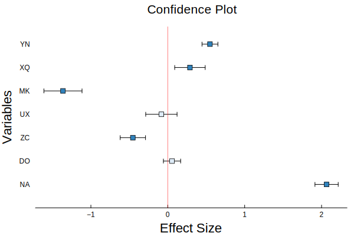

# WolfRiverPlots.jl

*Statistical plotting recipes for QTL analysis.*

[](https://github.com/senresearch/WolfRiverPlots.jl/actions/workflows/ci.yml)
[](https://codecov.io/gh/senresearch/WolfRiverPlots.jl)

`WolfRiverPlots.jl` is a versatile plotting package built in the Julia programming language. The package consists of specific plotting recipes, designed to streamline data visualization and enhance the process of statistical analysis.

## Features
Here are the main functions provided by WolfRiverPlots.jl:

- `confidenceplot()`: todo


## Installation
To install `WolfRiverPlots.jl`, you can use Julia's package manager. Here is the command:

```julia
using Pkg
Pkg.add("WolfRiverPlots")
```

## Usage
After installing `WolfRiverPlots.jl`, you can include it in your Julia script using the following command:

```julia
using WolfRiverPlots
```

From there, you can start using `plot_QTL` and `plot_eQTL` to plot your data. For example:

```julia
# Assuming `single_results_perms` are restulting lod scores
# gInfo contains genotype information  
plot_QTL(single_results_perms, gInfo)
```
```julia
# Assuming `lod_scores` are in multipletraits_results
# pInfo contains phenotype information
# gInfo contains genotype information  
# thresh is your LOD threshold value
plot_eQTL(multipletraits_results, pInfo, gInfo; threshold = 5.0)
```
## Examples
The following examples provide a basic idea of how to use the functions provided by `WolfRiverPlots.jl`. Before proceeding, ensure that you've installed `WolfRiverPlots.jl` and imported it into your Julia script using `using WolfRiverPlots` along with `Plots.jl`.

### Example 1: Confidence Plot
```julia
using WolfRiverPlots
using Distributions, Random
using Plots#, ColorSchemes
# using Helium

########
# Data #
########

x = randn(7)

y = repeat([""], 7)
y = map(x -> randstring('A':'Z', 2), y)

ε = rand(Uniform(0.1,2), 7)

########
# Plot #
########
confidenceplot(x, y, ε)
```




## Contribution
Contributions to WolfRiverPlots.jl are welcome and appreciated. If you'd like to contribute, please fork the repository and make changes as you'd like. If you have any questions or issues, feel free to open an issue on the repository.

## License
`WolfRiverPlots.jl` is licensed under the [GNU AFFERO GENERAL PUBLIC LICENSE](LICENSE). For more information, please refer to the LICENSE file in the repository.

## Support
If you have any problems or questions using `WolfRiverPlots.jl`, please open an issue on the GitHub repository. We'll be happy to help!